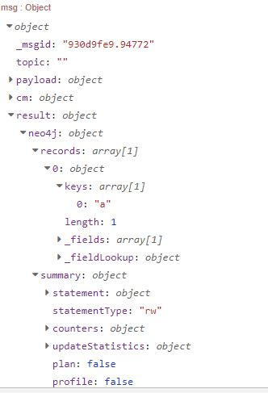
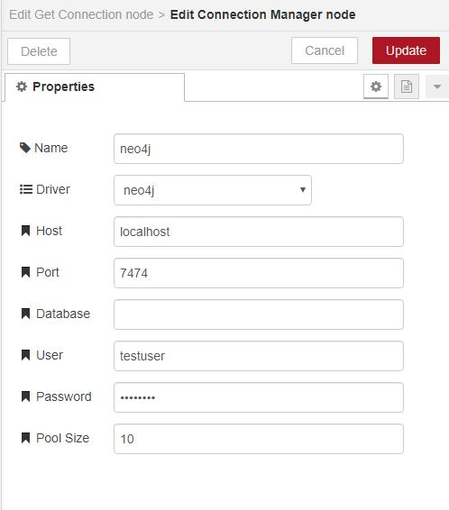
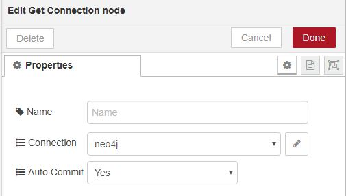
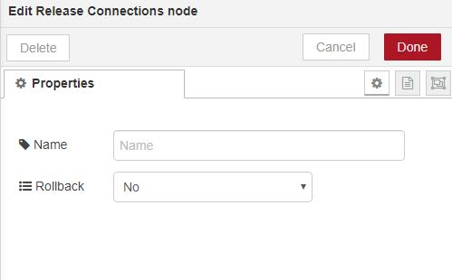
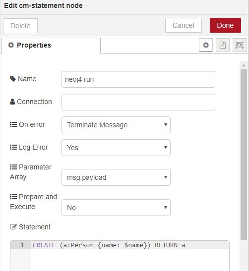
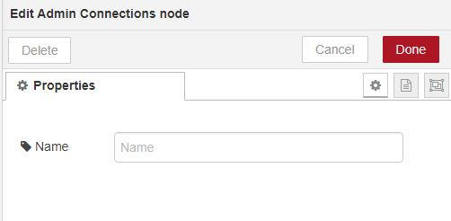
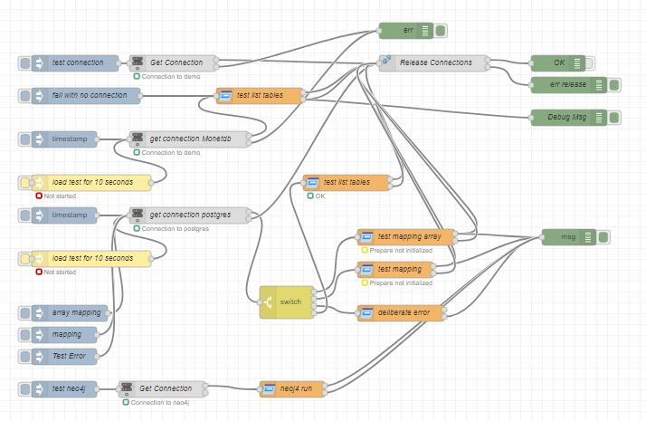

# [node-red-contrib-connectionmanager][2]

[Node-Red][1] generalized connection manager to allow connection pooling and UOW (unit of work) over multiple nodes. 
Maximizes asynchronous processing which is dependent on driver provider. Some drivers allow for more asynchronous processing. 
Tries to enable a common framework for connections which includes common pooling and minimization of variance in language implementations. For example for SQL alignment with ISO standard.  Should help minimize swap between technologies. Other languages will be evolved as developed.

Currently handles following connection types:
* postgreSQL
* monetdb
* neo4j
* db2 (not tested)

and has been built in a way to readily add more types. 
Very quick if driver base aligns with deployed type.

Simple example for neo4j connection

Results in msg.  Note, example is results for neoj4. For relational connections results standardized. In future, will give option of standardised form versus "as per software provider". 

## Features
* Connection acquired and used across a series of nodes so transactional UOW can be formed
* More than once connection can be involved in UOW
* Releases a connection if it has not been released for a minute.  Cater form work flows that have not properly completed or unexpected error 
* Works with postgreSQL, neo4j, monetdb and experimental db2.  Note, drivers must be install separately and will be acquired when needed. 
* Simple data mappings
* Array input for multiple execution of statement.  Useful for bulk loads
* The one statement and set of values can be sent to multiple connections.

### Standardisation
* postgres parameter markers as ? in line with ISO

## Node Summary
* Connection Manager - Configuration of connection pool including size 
* Get Connection - acquires a connection for the work flow
* Release Connection - releases all connections back to pool
* Statement - statement to be executed against connection pool or all connection pools
* Admin Connections - get details on pool and manage pool

------------------------------------------------------------
# Nodes in Detail

## Connection Manager

Configurations nodes that can be accessed via get connection.  

## Get Connection
Get a connection for a message and adds to the message as a property.
A message can have many connections.
Connection is used by all subsequent statement nodes.

## Release Connection
Releases all connections from a message and frees connections to be used by new messages.
Message can be committed or rolled back to checkpoint,
All statements executed from get connection can be formed as part of UOW.  

## Statement

The statement will be executed against connection associated with the message.
This can be minimized to only one of the connections by detailing the connection name. 

## Admin Connection

This node takes in actions specified by the topic.
Valid actions:
* list - Output payload contain metrics on connection pools
* releasestale - Puts connections that appear to be active back into pool
* releaseFree - releases connections from pool that are free
* toggleDebug - Sends more debug information to system log

In future will be used as a means of dynamically changes certain properties sunch as pool size.

------------------------------------------------------------

# To Do List

1. Add transactional - option on connection manager and release to have commit/rollback
* Standardised results format, at moment default of driver
* Add more DBMS drivers
* Add NoSQL drivers
* Performance metrics
* Dynamically change size of pool
* Wait on connection to become free
* Configurable stale connection cycle

------------------------------------------------------------

# Install

Run the following command in the root directory of your Node-RED install

    npm install node-red-contrib-connectionmanager

If used 

    npm install pg						postgreSQL
    npm install neo4j-driver
    npm install monetdb-nodejs
    npm install ibm_db				Db2

# Tests

Test/example flow in test/generalTest.json

_Note_ The examples will require the drivers to be installed

------------------------------------------------------------

# Version

0.0.3 fix bug with error handling and arrays.  Add pg in to package dependencies.  More debug details.

0.0.2 get rid of monetdb warning.  Add in access to flow.get env.get, global.get

0.0.1 base

------------------------------------------------------------

# Author

[Peter Prib][3]

[1]: http://nodered.org
[2]: https://www.npmjs.com/package/connectionmanager
[3]: https://github.com/peterprib
